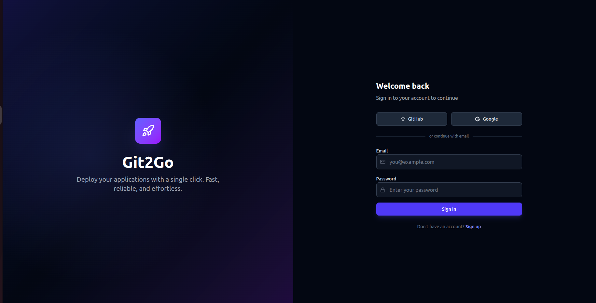
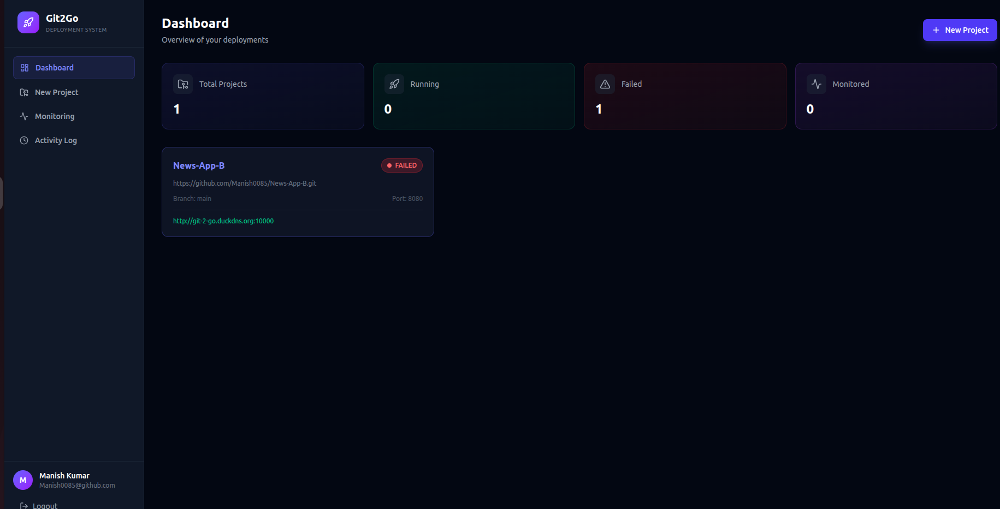
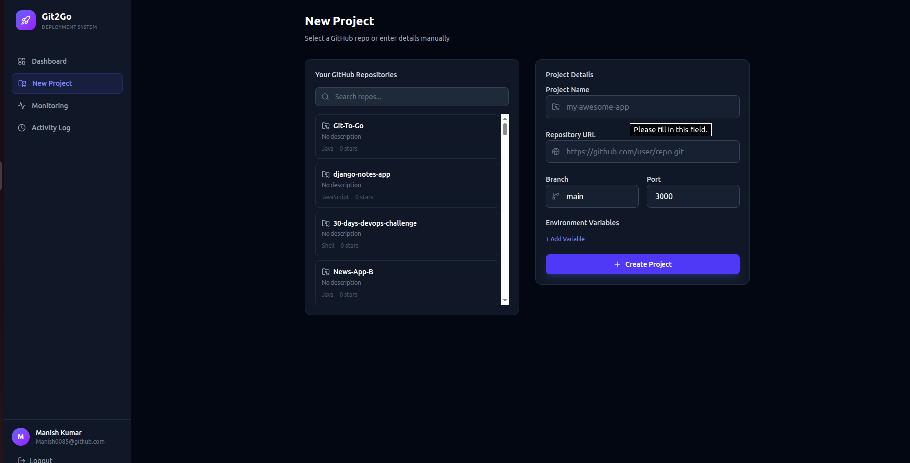
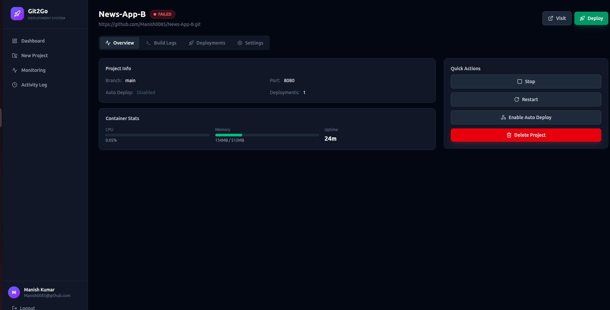
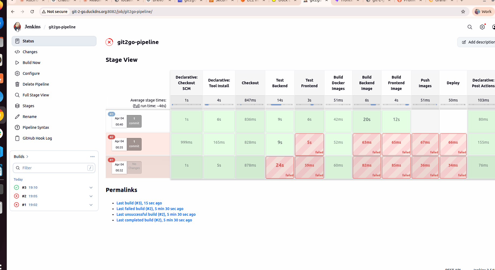
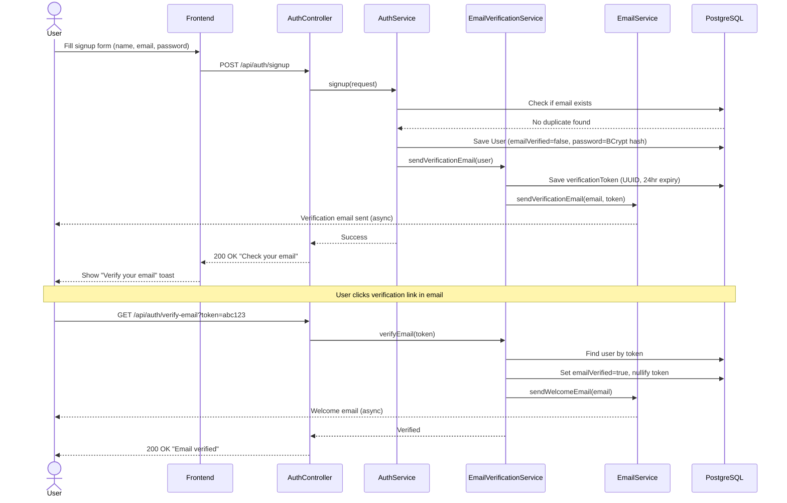
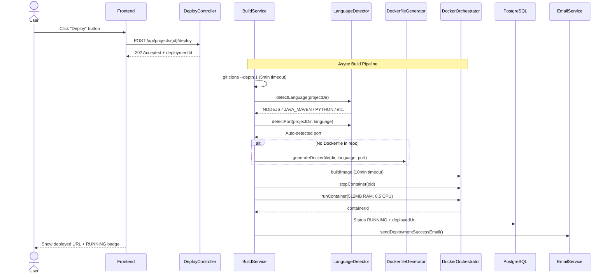
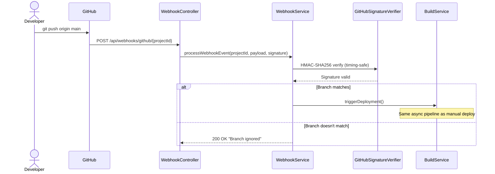

# Git-To-Go

**A single-click deployment platform that turns any GitHub repository into a running Docker container.**

Git-To-Go is a self-hosted PaaS (Platform as a Service) — think of it as a mini Heroku/Vercel. Users connect their GitHub repos, and the platform automatically detects the language, generates a Dockerfile (if needed), builds a Docker image, and deploys it as a container — all with a single click.

**Live Demo:** [http://git-2-go.duckdns.org](http://git-2-go.duckdns.org)

---

## Screenshots

### Login Page
OAuth login with GitHub and Google, or email/password authentication.



### Dashboard
Overview of all projects with stats — total projects, running, failed, monitored.



### Create Project
Import repos directly from your GitHub account or enter repository URL manually. Configure branch, port, and environment variables.



### Project Detail
Manage deployments, view build logs, container stats (CPU, memory, uptime), and quick actions — stop, restart, enable auto-deploy, delete.



### Jenkins CI/CD Pipeline
Automated pipeline with stages — Checkout, Test Backend, Test Frontend, Build Docker Images, Push Images, Deploy.



---

## Architecture Overview

```
                         +------------------+
                         |   React Frontend |
                         |   (Vite :5173)   |
                         +--------+---------+
                                  |
                            REST API + WebSocket
                                  |
                         +--------+---------+
                         | Spring Boot API  |
                         |    (Java :8080)  |
                         +----+------+------+
                              |      |
                +-------------+      +-------------+
                |                                   |
        +-------+--------+               +---------+--------+
        |   PostgreSQL   |               |  Docker Engine   |
        |  (AWS RDS)     |               | (Build & Deploy) |
        +----------------+               +------------------+
```

### Production Architecture (AWS)

```
                    User → http://git-2-go.duckdns.org
                                    |
                              ┌─────┴─────┐
                              │   NGINX   │ :80
                              │  Reverse  │ Rate Limiting
                              │  Proxy    │ Gzip + Security Headers
                              └──┬────┬───┘
                          /api/* │    │ /*
                                 ▼    ▼
                       ┌──────────┐ ┌──────────┐
                       │ Backend  │ │ Frontend │
                       │ :8080    │ │ :3000    │
                       │ Spring   │ │ React +  │
                       │ Boot     │ │ Nginx    │
                       └────┬─────┘ └──────────┘
                            │
                  ┌─────────┼──────────┐
                  ▼         ▼          ▼
           ┌──────────┐ ┌────────┐ ┌──────────┐
           │ AWS RDS  │ │ Docker │ │ Jenkins  │
           │ Postgres │ │ Engine │ │ CI/CD    │
           │          │ │(deploy)│ │ :8082    │
           └──────────┘ └────────┘ └──────────┘

           ┌──────────┐ ┌────────┐ ┌──────────┐
           │Prometheus│ │Grafana │ │ cAdvisor │
           │ :9090    │ │ :3001  │ │ :8081    │
           └──────────┘ └────────┘ └──────────┘
```

### How a Deployment Works (Behind the Scenes)

```
User clicks "Deploy"
       |
       v
[1] Controller receives request (returns 202 Accepted immediately)
       |
       v
[2] Deployment entity created (status: QUEUED)
       |
       v
[3] Async build pipeline starts in background thread pool
       |
       v
[4] Git Clone ──> shallow clone (--depth 1) with 5-min timeout
       |
       v
[5] Language Detection ──> checks marker files (package.json, pom.xml, go.mod, etc.)
       |
       v
[6] Port Auto-Detection ──> config files → language defaults → Dockerfile EXPOSE
       |
       v
[7] Dockerfile Generation ──> if no Dockerfile exists, generates optimized multi-stage build
       |
       v
[8] Docker Build ──> builds image with 10-min timeout (git2go/<project>:v<version>)
       |
       v
[9] Stop Old Container ──> gracefully stops previous deployment
       |
       v
[10] Docker Run ──> starts container (512MB RAM, 0.5 CPU limit, dynamic port)
       |
       v
[11] Status Update ──> deployment marked RUNNING, deployed URL saved
       |
       v
[12] Email Notification ──> success/failure email sent to user
```

---

## Sequence Diagrams

### 1. User Signup & Email Verification



### 2. Login (Email/Password + OAuth2)

```mermaid
sequenceDiagram
    actor User
    participant Frontend
    participant AuthController
    participant AuthService
    participant JwtTokenProvider
    participant RefreshTokenService
    participant DB as PostgreSQL

    rect rgb(40, 40, 60)
    Note over User,DB: Email/Password Login
    User->>Frontend: Enter email & password
    Frontend->>AuthController: POST /api/auth/login
    AuthController->>AuthService: login(email, password)
    AuthService->>DB: Find user by email
    AuthService->>AuthService: BCrypt.matches(password, hash)
    AuthService->>JwtTokenProvider: generateToken(email)
    JwtTokenProvider-->>AuthService: JWT (HMAC-SHA256, 1hr expiry)
    AuthService->>RefreshTokenService: createRefreshToken(user)
    AuthService-->>AuthController: AuthResponse {accessToken, refreshToken, user}
    AuthController-->>Frontend: 200 OK + tokens
    Frontend-->>User: Redirect to /dashboard
    end

    rect rgb(40, 60, 40)
    Note over User,DB: OAuth2 Login (GitHub/Google)
    User->>Frontend: Click "Login with GitHub"
    Frontend->>AuthController: GET /oauth2/authorization/github
    AuthController-->>User: Redirect to GitHub login page
    User->>AuthController: GitHub callback with auth code
    AuthController->>DB: Create or update User (GITHUB provider)
    AuthController->>DB: Encrypt & store GitHub access token (AES-256-GCM)
    AuthController->>JwtTokenProvider: generateToken(email)
    AuthController-->>Frontend: Redirect to /oauth2/callback?token=xxx&refreshToken=yyy
    Frontend-->>User: Redirect to /dashboard
    end
```



### 3. One-Click Deployment (Core Flow)



### 4. GitHub Webhook Auto-Deploy



---

## Tech Stack

| Layer | Technology | Purpose |
|-------|-----------|---------|
| Frontend | React 19, Vite 8, Tailwind CSS 4 | SPA with dark theme UI |
| Backend | Spring Boot 4.0.4, Java 17 | REST API + business logic |
| Database | PostgreSQL (AWS RDS) | Managed persistent data store |
| Containerization | Docker (CLI via ProcessBuilder) | Build & run user apps |
| Auth | JWT + OAuth2 (Google, GitHub) | Stateless authentication |
| Real-time | WebSocket (STOMP + SockJS) | Live build log streaming |
| Monitoring | Prometheus + Grafana + cAdvisor | Metrics, dashboards, container stats |
| CI/CD | Jenkins (Declarative Pipeline) | Automated build + deploy on push |
| Reverse Proxy | Nginx | Routing, rate limiting, gzip, security headers |
| Email | Brevo SMTP + Thymeleaf | Notification templates |
| Hosting | AWS EC2 + RDS | Production deployment |
| Domain | DuckDNS | Free DNS |

---

## Features

- **One-Click Deploy** — Push a GitHub repo, click deploy, get a running URL
- **Auto Language Detection** — Supports Node.js, Java (Maven/Gradle), Python, Go, Static HTML
- **Auto Dockerfile Generation** — No Dockerfile needed for supported languages
- **Auto Port Detection** — Detects app port from config files, Dockerfile, or language defaults
- **GitHub OAuth** — Import repos directly from your GitHub account
- **GitHub Webhooks** — Auto-deploy on push to configured branch (HMAC-SHA256 verified)
- **Real-time Logs** — WebSocket-based live build & runtime log streaming
- **Container Monitoring** — CPU, memory, uptime stats with auto-refresh
- **Health Checks** — Automatic health monitoring every 60s (3 failures = alert)
- **Admin Panel** — User management, force-stop deployments, platform stats
- **Audit Logging** — Every sensitive action tracked (who, what, when, from where)
- **Email Notifications** — Verification, deploy success/failure emails
- **Rate Limiting** — Sliding window (20 req/min) on auth endpoints
- **Role-Based Access** — USER and ADMIN roles with granular permissions
- **Jenkins CI/CD** — Automated pipeline with GitHub webhook trigger
- **Prometheus + Grafana** — Production monitoring with dashboards
- **S3 Log Storage** — Optional AWS S3 for log persistence (Strategy Pattern)

---

## Supported Languages

| Language | Detected By | Dockerfile Generated |
|----------|------------|---------------------|
| Node.js | `package.json` | Multi-stage (node:alpine) |
| Java (Maven) | `pom.xml` | Multi-stage (maven + eclipse-temurin) |
| Java (Gradle) | `build.gradle` | Multi-stage (gradle + eclipse-temurin) |
| Python | `requirements.txt` / `Pipfile` / `pyproject.toml` | python:slim |
| Go | `go.mod` | Multi-stage (golang:alpine + scratch) |
| Static HTML | `index.html` | nginx:alpine |
| Custom | User's `Dockerfile` | Uses existing Dockerfile as-is |

> If the repo already contains a `Dockerfile`, the platform uses it directly without generating one. Single-stage Dockerfiles are automatically replaced with multi-stage builds for supported languages.

---

## Project Structure

```
Git-To-Go/
├── backend/                    # Spring Boot API (Java 17, Maven)
│   ├── Dockerfile              # Multi-stage: Maven build → JRE runtime
│   ├── pom.xml
│   └── src/main/
│       ├── java/com/git2go/platform/
│       │   ├── config/         # Security, Async, WebSocket, CORS configs
│       │   ├── controller/     # 9 REST controllers
│       │   ├── entity/         # 7 JPA entities
│       │   ├── enums/          # Role, Status, Language enums
│       │   ├── service/        # 16 services (core business logic)
│       │   ├── repository/     # Spring Data JPA repositories
│       │   ├── security/       # JWT, OAuth2, Rate limiting
│       │   ├── orchestrator/   # Docker container management (Strategy Pattern)
│       │   ├── logging/        # File + S3 log storage (Strategy Pattern)
│       │   ├── audit/          # AOP-based audit logging
│       │   ├── dto/            # Request/Response DTOs
│       │   ├── exception/      # Global exception handling
│       │   └── util/           # Encryption, port allocation, signature verification
│       └── resources/
│           └── application.yaml
│
├── frontend/                   # React SPA (Vite + Tailwind)
│   ├── Dockerfile              # Multi-stage: Node build → Nginx serve
│   ├── package.json
│   └── src/
│       ├── api/                # Axios HTTP client + API modules
│       ├── components/         # Reusable UI + layout components
│       ├── context/            # Auth context (JWT + OAuth state)
│       └── pages/              # Route pages (Dashboard, Projects, Admin, etc.)
│
├── nginx/
│   └── nginx.conf              # Reverse proxy, rate limiting, security headers
│
├── scripts/
│   └── setup-server.sh         # One-command server setup (Docker, Jenkins, project)
│
├── docker-compose.yml          # Production stack (6 services)
├── Jenkinsfile                 # CI/CD pipeline (6 stages)
├── .env.example                # Environment template
└── images/                     # Screenshots
```

---

## DevOps & Deployment

### Production Stack (Docker Compose)

| Service | Image | Port | Purpose |
|---------|-------|------|---------|
| Backend | git-to-go-backend | 8080 | Spring Boot API |
| Frontend | git-to-go-frontend | 3000 | React + Nginx |
| Nginx | nginx:1.27-alpine | 80/443 | Reverse proxy |
| Prometheus | prom/prometheus | 9090 | Metrics collection |
| Grafana | grafana/grafana | 3001 | Monitoring dashboards |
| cAdvisor | cadvisor | 8081 | Container metrics |

**External services:** AWS RDS (PostgreSQL), Jenkins (standalone :8082)

### CI/CD Pipeline (Jenkins)

```
git push → GitHub Webhook → Jenkins auto-trigger
    │
    ├── Stage 1: Checkout
    ├── Stage 2: Test Backend (Maven)
    ├── Stage 3: Test Frontend (npm lint + build)
    ├── Stage 4: Build Docker Images (parallel)
    ├── Stage 5: Push to Docker Hub
    └── Stage 6: Deploy (SSH → docker compose up)
```

### One-Command Server Setup

```bash
chmod +x scripts/setup-server.sh
sudo ./scripts/setup-server.sh
```

Installs Docker, Jenkins, PostgreSQL client, configures firewall, clones project, and generates `.env` with auto-generated secrets.

---

## Quick Start (Local Development)

### Prerequisites

- Java 17+, Node.js 22+, Docker, PostgreSQL, Maven 3.8+

### Backend

```bash
cd backend
cp .env.example .env    # Fill real values
./mvnw spring-boot:run
```

### Frontend

```bash
cd frontend
npm install
npm run dev
```

### Production (Docker Compose)

```bash
cp .env.example .env    # Fill real values
docker compose up -d --build
```

---

## API Endpoints

| Module | Base Path | Key Endpoints |
|--------|----------|---------------|
| Auth | `/api/auth` | signup, login, refresh, logout, verify-email |
| Projects | `/api/projects` | CRUD + deploy trigger |
| Deployments | `/api/deployments` | get, stop, restart |
| Logs | `/api/deployments/{id}/logs` | build logs, runtime logs, stream |
| Webhooks | `/api/webhooks` | GitHub webhook receiver + config |
| Monitoring | `/api/monitoring` | container stats, health checks |
| Admin | `/api/admin` | dashboard, user/project management |
| Audit | `/api/audit` | activity feed, resource history |
| User | `/api/user` | profile, GitHub repos |

---

## Security

| Mechanism | Implementation |
|-----------|---------------|
| Password Hashing | BCrypt with salt |
| Token Auth | JWT (HMAC-SHA256), 1hr access + 7d refresh |
| OAuth2 | Google + GitHub with encrypted token storage |
| Encryption | AES-256-GCM for secrets (GitHub tokens, webhook secrets) |
| Webhook Verification | HMAC-SHA256 with timing-safe comparison |
| Rate Limiting | Sliding window, 20 req/min on auth endpoints |
| RBAC | USER/ADMIN roles via Spring Security `@PreAuthorize` |
| Audit Trail | AOP-based logging of all sensitive operations |
| Email Verification | UUID token with 24-hour expiry (one-time use) |
| Secrets Management | `.env` files (git-ignored), no hardcoded secrets |
| Nginx Security | X-Frame-Options, X-Content-Type-Options, XSS Protection |

---

## Monitoring

- **Prometheus** scrapes Spring Boot Actuator metrics (JVM, HTTP, DB pool) + cAdvisor container metrics every 10s
- **Grafana** visualizes metrics with customizable dashboards
- **cAdvisor** auto-monitors all Docker containers (CPU, memory, network I/O)
- **Built-in Health Checks** run every 60s — 3 consecutive failures mark deployment as FAILED

---

## Environment Variables

| Variable | Description |
|----------|-------------|
| `SPRING_DATASOURCE_URL` | PostgreSQL connection URL |
| `SPRING_DATASOURCE_USERNAME` | Database username |
| `SPRING_DATASOURCE_PASSWORD` | Database password |
| `JWT_SECRET` | Base64-encoded JWT signing key |
| `SPRING_SECURITY_OAUTH2_CLIENT_REGISTRATION_GITHUB_CLIENT_ID` | GitHub OAuth client ID |
| `SPRING_SECURITY_OAUTH2_CLIENT_REGISTRATION_GITHUB_CLIENT_SECRET` | GitHub OAuth client secret |
| `SPRING_SECURITY_OAUTH2_CLIENT_REGISTRATION_GOOGLE_CLIENT_ID` | Google OAuth client ID |
| `SPRING_SECURITY_OAUTH2_CLIENT_REGISTRATION_GOOGLE_CLIENT_SECRET` | Google OAuth client secret |
| `SPRING_MAIL_HOST` | SMTP server host |
| `SPRING_MAIL_USERNAME` | SMTP username |
| `SPRING_MAIL_PASSWORD` | SMTP password |
| `ENCRYPTION_KEY` | AES-256 key (Base64, 32 bytes) |
| `CORS_ORIGINS` | Allowed frontend origins |
| `DEPLOYMENT_BASE_URL` | Base URL for deployed apps |
| `OAUTH2_REDIRECT_URI` | OAuth2 callback URL |

See `.env.example` for the complete template.

---

## License

This project is for educational and portfolio purposes.
