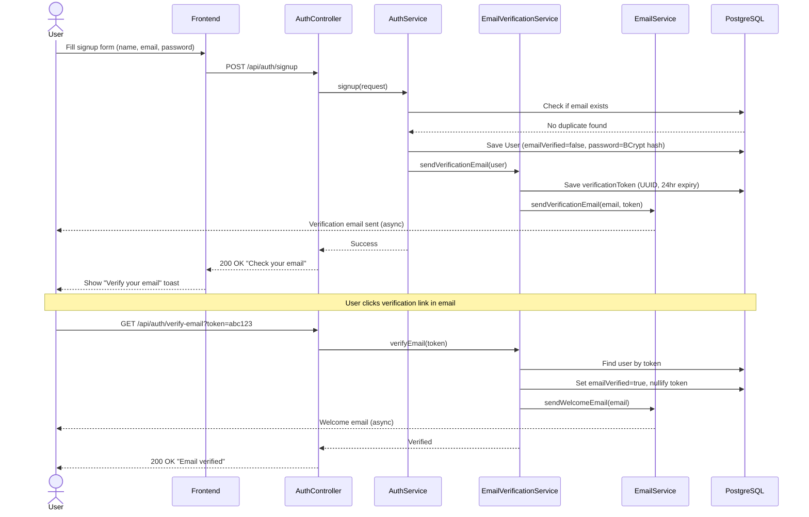
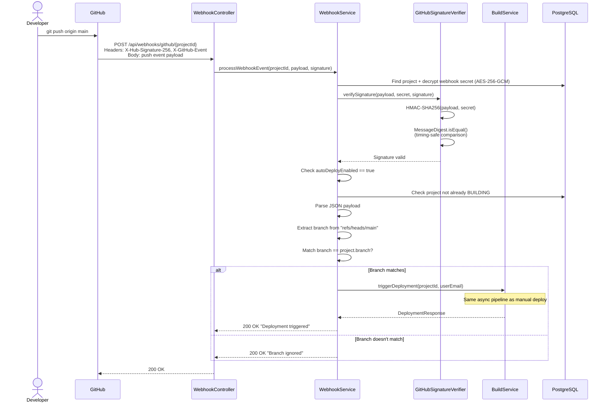
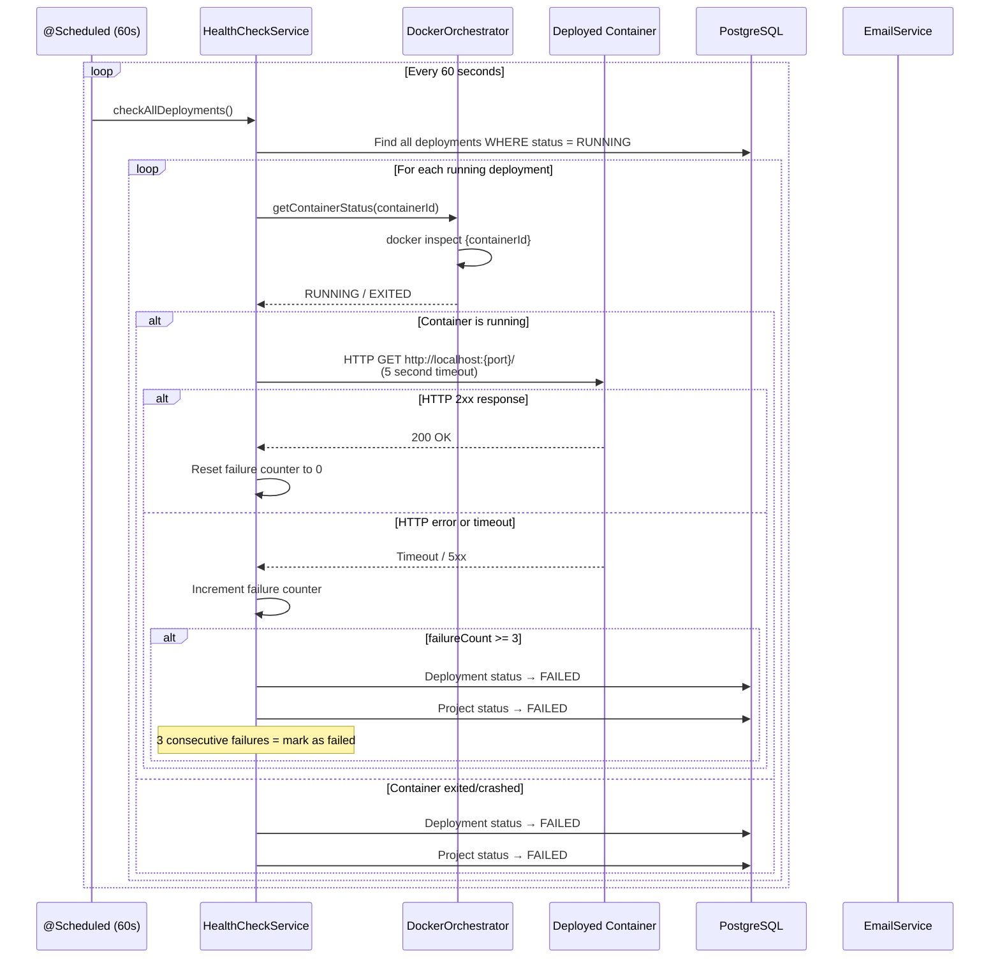

# Git-To-Go

**A single-click deployment platform that turns any GitHub repository into a running Docker container.**

Git-To-Go is a self-hosted PaaS (Platform as a Service) — think of it as a mini Heroku/Vercel. Users connect their GitHub repos, and the platform automatically detects the language, generates a Dockerfile (if needed), builds a Docker image, and deploys it as a container — all with a single click.

---

## Architecture Overview

```
                         +------------------+
                         |   React Frontend |
                         |   (Vite :5173)   |
                         +--------+---------+
                                  |
                            REST API + WebSocket
                                  |
                         +--------+---------+
                         | Spring Boot API  |
                         |    (Java :8080)  |
                         +----+------+------+
                              |      |
                +-------------+      +-------------+
                |                                   |
        +-------+--------+               +---------+--------+
        |   PostgreSQL   |               |  Docker Engine   |
        |  (Data Store)  |               | (Build & Deploy) |
        +----------------+               +------------------+
```

### How a Deployment Works (Behind the Scenes)

```
User clicks "Deploy"
       |
       v
[1] Controller receives request (returns 202 Accepted immediately)
       |
       v
[2] Deployment entity created (status: QUEUED)
       |
       v
[3] Async build pipeline starts in background thread pool
       |
       v
[4] Git Clone ──> shallow clone (--depth 1) with 5-min timeout
       |
       v
[5] Language Detection ──> checks marker files (package.json, pom.xml, go.mod, etc.)
       |
       v
[6] Dockerfile Generation ──> if no Dockerfile exists, generates optimized multi-stage build
       |
       v
[7] Docker Build ──> builds image with 10-min timeout (git2go/<project>:v<version>)
       |
       v
[8] Stop Old Container ──> gracefully stops previous deployment
       |
       v
[9] Docker Run ──> starts container (512MB RAM, 0.5 CPU limit, dynamic port)
       |
       v
[10] Status Update ──> deployment marked RUNNING, deployed URL saved
       |
       v
[11] Email Notification ──> success/failure email sent to user
```

---

## Sequence Diagrams

### 1. User Signup & Email Verification



### 2. Login (Email/Password + OAuth2)

```mermaid
sequenceDiagram
    actor User
    participant Frontend
    participant AuthController
    participant AuthService
    participant JwtTokenProvider
    participant RefreshTokenService
    participant DB as PostgreSQL

    rect rgb(40, 40, 60)
    Note over User,DB: Email/Password Login
    User->>Frontend: Enter email & password
    Frontend->>AuthController: POST /api/auth/login
    AuthController->>AuthService: login(email, password)
    AuthService->>DB: Find user by email
    AuthService->>AuthService: BCrypt.matches(password, hash)
    AuthService->>AuthService: Check emailVerified == true
    AuthService->>JwtTokenProvider: generateToken(email)
    JwtTokenProvider-->>AuthService: JWT (HMAC-SHA256, 1hr expiry)
    AuthService->>RefreshTokenService: createRefreshToken(user)
    RefreshTokenService->>DB: Save RefreshToken (UUID, 7d expiry)
    RefreshTokenService-->>AuthService: refreshToken
    AuthService-->>AuthController: AuthResponse {accessToken, refreshToken, user}
    AuthController-->>Frontend: 200 OK + tokens
    Frontend->>Frontend: Store tokens in localStorage
    Frontend-->>User: Redirect to /dashboard
    end

    rect rgb(40, 60, 40)
    Note over User,DB: OAuth2 Login (GitHub/Google)
    User->>Frontend: Click "Login with GitHub"
    Frontend->>AuthController: GET /oauth2/authorization/github
    AuthController-->>User: Redirect to GitHub login page
    User->>User: Authorize on GitHub
    User->>AuthController: GitHub callback with auth code
    AuthController->>AuthController: Exchange code for GitHub access token
    AuthController->>AuthController: Fetch user profile from GitHub API
    AuthController->>DB: Create or update User (GITHUB provider)
    AuthController->>DB: Encrypt & store GitHub access token (AES-256-GCM)
    AuthController->>JwtTokenProvider: generateToken(email)
    AuthController->>RefreshTokenService: createRefreshToken(user)
    AuthController-->>Frontend: Redirect to /oauth2/callback?token=xxx&refreshToken=yyy
    Frontend->>Frontend: Extract tokens from URL, store in localStorage
    Frontend->>AuthController: GET /api/user/me (with Bearer token)
    AuthController-->>Frontend: User profile
    Frontend-->>User: Redirect to /dashboard
    end
```



### 3. One-Click Deployment (Core Flow)

```mermaid
sequenceDiagram
    actor User
    participant Frontend
    participant DeployController
    participant BuildService
    participant LangDetector as LanguageDetector
    participant DockerfileGen as DockerfileGenerator
    participant Docker as DockerOrchestrator
    participant DB as PostgreSQL
    participant Email as EmailService

    User->>Frontend: Click "Deploy" button
    Frontend->>DeployController: POST /api/projects/{id}/deploy

    rect rgb(50, 40, 40)
    Note over DeployController,DB: Synchronous (Controller Thread)
    DeployController->>BuildService: triggerDeployment(projectId, userEmail)
    BuildService->>DB: Validate project ownership
    BuildService->>DB: Create Deployment (status: QUEUED)
    BuildService->>DB: Project status → BUILDING
    BuildService->>BuildService: Eagerly load env vars into HashMap
    BuildService-->>DeployController: DeploymentResponse
    DeployController-->>Frontend: 202 Accepted + deploymentId
    Frontend-->>User: Show "Deployment started" toast
    end

    Note over Frontend: Frontend polls deployment status

    rect rgb(40, 40, 55)
    Note over BuildService,Docker: Async (@Async "buildExecutor" thread pool)

    BuildService->>DB: Update status → CLONING
    BuildService->>BuildService: git clone --depth 1 --branch main <repo><br/>(ProcessBuilder, 5min timeout)
    BuildService->>BuildService: Clone successful

    BuildService->>LangDetector: detectLanguage(projectDir)
    LangDetector->>LangDetector: Check marker files<br/>(package.json? pom.xml? go.mod?)
    LangDetector-->>BuildService: NODEJS / JAVA_MAVEN / PYTHON / etc.

    BuildService->>LangDetector: hasDockerfile(projectDir)?
    alt No Dockerfile in repo
        LangDetector-->>BuildService: false
        BuildService->>DockerfileGen: generateDockerfile(dir, language, port)
        DockerfileGen-->>BuildService: Dockerfile written to project dir
    else Dockerfile exists
        LangDetector-->>BuildService: true
        BuildService->>BuildService: Using existing Dockerfile
    end

    BuildService->>DB: Update status → BUILDING
    BuildService->>Docker: buildImage(dir, "git2go/myapp:v1")
    Docker->>Docker: docker build -t git2go/myapp:v1 .<br/>(ProcessBuilder, 10min timeout)
    Docker-->>BuildService: Image built

    BuildService->>Docker: stopContainer(oldContainerId)
    BuildService->>Docker: removeContainer(oldContainerId)
    Note over Docker: Old container gracefully stopped

    BuildService->>DB: Update status → DEPLOYING
    BuildService->>Docker: runContainer(image, port, envVars, 512MB, 0.5CPU)
    Docker->>Docker: docker run -d --name git2go-myapp-v1<br/>-p 9001:3000 --memory 512m --cpus 0.5<br/>-e KEY=VAL git2go/myapp:v1
    Docker-->>BuildService: containerId

    BuildService->>DB: Save containerId, hostPort, deployedUrl
    BuildService->>DB: Update status → RUNNING
    BuildService->>DB: Project status → RUNNING, deployedUrl saved
    BuildService->>Email: sendDeploymentSuccessEmail(user, url, version)
    Email-->>User: Success email (async)
    end

    Frontend->>DeployController: GET /api/deployments/{id} (polling)
    DeployController-->>Frontend: {status: RUNNING, deployedUrl: "http://host:9001"}
    Frontend-->>User: Show deployed URL + RUNNING badge
```



### 4. GitHub Webhook Auto-Deploy



### 5. JWT Token Refresh (Auto-Refresh by Frontend)

```mermaid
sequenceDiagram
    actor User
    participant Frontend
    participant AxiosInterceptor as Axios Interceptor
    participant API as Any API Endpoint
    participant AuthController
    participant RefreshTokenService
    participant JwtTokenProvider
    participant DB as PostgreSQL

    User->>Frontend: Perform any action (e.g., view dashboard)
    Frontend->>API: GET /api/projects (Bearer: expired_token)
    API-->>AxiosInterceptor: 401 Unauthorized

    rect rgb(50, 50, 35)
    Note over AxiosInterceptor,DB: Automatic Token Refresh
    AxiosInterceptor->>AuthController: POST /api/auth/refresh {refreshToken}
    AuthController->>RefreshTokenService: verifyRefreshToken(token)
    RefreshTokenService->>DB: Find RefreshToken by token value
    RefreshTokenService->>RefreshTokenService: Check expiry (< 7 days)
    RefreshTokenService->>DB: Delete old refresh token
    RefreshTokenService->>DB: Create new refresh token
    RefreshTokenService-->>AuthController: New refresh token
    AuthController->>JwtTokenProvider: generateToken(email)
    JwtTokenProvider-->>AuthController: New JWT (1hr expiry)
    AuthController-->>AxiosInterceptor: {accessToken, refreshToken}
    AxiosInterceptor->>AxiosInterceptor: Update localStorage with new tokens
    end

    AxiosInterceptor->>API: GET /api/projects (Bearer: new_token) [retry]
    API-->>Frontend: 200 OK + project data
    Frontend-->>User: Dashboard rendered (seamless experience)
```



### 6. Real-Time Log Streaming (WebSocket)

```mermaid
sequenceDiagram
    actor User
    participant Frontend
    participant WebSocket as WebSocket /ws
    participant LogController
    participant LogService
    participant Docker as Docker Engine

    User->>Frontend: Open project detail → Build Logs tab

    Frontend->>WebSocket: CONNECT /ws (SockJS + STOMP)
    WebSocket-->>Frontend: CONNECTED

    Frontend->>WebSocket: SUBSCRIBE /topic/logs/{deploymentId}

    Frontend->>LogController: POST /deployments/{id}/logs/stream/start
    LogController->>LogService: startRuntimeLogStream(deploymentId)

    rect rgb(40, 50, 40)
    Note over LogService,Docker: @Async — 2 hour timeout
    LogService->>Docker: docker logs -f {containerId}<br/>(ProcessBuilder, follows output)

    loop Every new log line from container
        Docker-->>LogService: log line
        LogService->>LogService: Dedup check (ConcurrentHashMap)
        LogService->>WebSocket: SEND /topic/logs/{deploymentId}<br/>{message, level, timestamp}
        WebSocket-->>Frontend: MESSAGE {log entry}
        Frontend-->>User: Log line appears in real-time
    end
    end

    User->>Frontend: Navigate away / Click stop
    Frontend->>LogController: POST /deployments/{id}/logs/stream/stop
    LogController->>LogService: stopRuntimeLogStream(deploymentId)
    LogService->>LogService: Process.destroy()
    Frontend->>WebSocket: UNSUBSCRIBE
    Frontend->>WebSocket: DISCONNECT
```



### 7. Health Check & Auto-Recovery



### 8. Admin Force-Stop & Audit Trail

```mermaid
sequenceDiagram
    actor Admin
    participant Frontend
    participant AdminController
    participant AdminService
    participant Docker as DockerOrchestrator
    participant AuditAspect
    participant DB as PostgreSQL

    Admin->>Frontend: Click "Force Stop" on a deployment
    Frontend->>AdminController: POST /api/admin/deployments/{id}/stop

    Note over AdminController: @PreAuthorize("hasRole('ADMIN')")

    AdminController->>AdminService: forceStopDeployment(deploymentId)

    rect rgb(50, 40, 50)
    Note over AdminService,DB: @Auditable(action = "ADMIN_FORCE_STOP")
    AuditAspect->>AuditAspect: Capture: admin email, IP address, timestamp

    AdminService->>DB: Find deployment (any user's)
    AdminService->>Docker: stopContainer(containerId)
    Docker->>Docker: docker stop {containerId}
    AdminService->>Docker: removeContainer(containerId)
    Docker->>Docker: docker rm {containerId}
    AdminService->>DB: Deployment status → FAILED
    AdminService->>DB: Project status → FAILED

    AuditAspect->>DB: Save AuditLog {<br/>  action: ADMIN_FORCE_STOP,<br/>  userEmail: admin@email.com,<br/>  result: SUCCESS,<br/>  resourceType: DEPLOYMENT,<br/>  resourceId: {id},<br/>  ipAddress: 192.168.1.x,<br/>  timestamp: now<br/>}
    end

    AdminService-->>AdminController: Success
    AdminController-->>Frontend: 200 OK
    Frontend-->>Admin: Show "Deployment stopped" toast
```



---

## Tech Stack

| Layer | Technology | Purpose |
|-------|-----------|---------|
| Frontend | React 19, Vite 8, Tailwind CSS 4 | SPA with dark theme UI |
| Backend | Spring Boot 4.0.4, Java 17 | REST API + business logic |
| Database | PostgreSQL | Persistent data store |
| Containerization | Docker (CLI via ProcessBuilder) | Build & run user apps |
| Auth | JWT + OAuth2 (Google, GitHub) | Stateless authentication |
| Real-time | WebSocket (STOMP + SockJS) | Live build log streaming |
| Monitoring | Spring Actuator + Micrometer | Health checks & metrics |
| Email | Spring Mail + Thymeleaf | Notification templates |

---

## Features

- **One-Click Deploy** — Push a GitHub repo, click deploy, get a running URL
- **Auto Language Detection** — Supports Node.js, Java (Maven/Gradle), Python, Go, Static HTML
- **Auto Dockerfile Generation** — No Dockerfile needed for supported languages
- **GitHub OAuth** — Import repos directly from your GitHub account
- **GitHub Webhooks** — Auto-deploy on push to configured branch (HMAC-SHA256 verified)
- **Real-time Logs** — WebSocket-based live build & runtime log streaming
- **Container Monitoring** — CPU, memory, uptime stats with auto-refresh
- **Health Checks** — Automatic health monitoring every 60s (3 failures = alert)
- **Admin Panel** — User management, force-stop deployments, platform stats
- **Audit Logging** — Every sensitive action tracked (who, what, when, from where)
- **Email Notifications** — Verification, deploy success/failure emails
- **Rate Limiting** — Sliding window (20 req/min) on auth endpoints
- **Role-Based Access** — USER and ADMIN roles with granular permissions

---

## Supported Languages

| Language | Detected By | Dockerfile Generated |
|----------|------------|---------------------|
| Node.js | `package.json` | Multi-stage (node:alpine) |
| Java (Maven) | `pom.xml` | Multi-stage (maven + eclipse-temurin) |
| Java (Gradle) | `build.gradle` | Multi-stage (gradle + eclipse-temurin) |
| Python | `requirements.txt` / `Pipfile` / `pyproject.toml` | python:slim |
| Go | `go.mod` | Multi-stage (golang:alpine + scratch) |
| Static HTML | `index.html` | nginx:alpine |
| Custom | User's `Dockerfile` | Uses existing Dockerfile as-is |

> If the repo already contains a `Dockerfile`, the platform uses it directly without generating one.

---

## Project Structure

```
Git-To-Go/
├── backend/                  # Spring Boot API (Java 17, Maven)
│   ├── pom.xml
│   └── src/main/
│       ├── java/com/git2go/platform/
│       │   ├── config/       # Security, Async, WebSocket, CORS configs
│       │   ├── controller/   # 8 REST controllers
│       │   ├── entity/       # 7 JPA entities
│       │   ├── enums/        # Role, Status, Language enums
│       │   ├── service/      # 14 services (core business logic)
│       │   ├── repository/   # Spring Data JPA repositories
│       │   ├── security/     # JWT, OAuth2, Rate limiting
│       │   ├── orchestrator/ # Docker container management
│       │   ├── logging/      # File-based log storage
│       │   ├── audit/        # AOP-based audit logging
│       │   ├── dto/          # Request/Response DTOs
│       │   ├── exception/    # Global exception handling
│       │   └── util/         # Encryption, port allocation, signature verification
│       └── resources/
│           └── application.yaml
│
├── frontend/                 # React SPA (Vite + Tailwind)
│   ├── package.json
│   ├── vite.config.js
│   └── src/
│       ├── api/              # Axios HTTP client + API modules
│       ├── components/       # Reusable UI + layout components
│       ├── context/          # Auth context (JWT + OAuth state)
│       ├── pages/            # Route pages (Dashboard, Projects, Admin, etc.)
│       └── main.jsx
│
└── .gitignore
```

---

## Getting Started

### Prerequisites

- **Java 17+**
- **Node.js 18+**
- **Docker** (running on the host machine)
- **PostgreSQL** (local or remote)
- **Maven 3.8+**

### Backend Setup

```bash
cd backend

# Set environment variables (or use defaults from application.yaml)
export DB_USERNAME=postgres
export DB_PASSWORD=postgres
export JWT_SECRET=<your-base64-secret>
export GITHUB_CLIENT_ID=<your-github-oauth-client-id>
export GITHUB_CLIENT_SECRET=<your-github-oauth-client-secret>
export GOOGLE_CLIENT_ID=<your-google-oauth-client-id>
export GOOGLE_CLIENT_SECRET=<your-google-oauth-client-secret>

# Run
./mvnw spring-boot:run
```

Backend starts on `http://localhost:8080`

### Frontend Setup

```bash
cd frontend

npm install
npm run dev
```

Frontend starts on `http://localhost:5173`

---

## API Endpoints (Summary)

| Module | Base Path | Key Endpoints |
|--------|----------|---------------|
| Auth | `/api/auth` | signup, login, refresh, logout, verify-email |
| Projects | `/api/projects` | CRUD + deploy trigger |
| Deployments | `/api/deployments` | get, stop, restart |
| Logs | `/api/deployments/{id}/logs` | build logs, runtime logs, stream |
| Webhooks | `/api/webhooks` | GitHub webhook receiver + config |
| Monitoring | `/api/monitoring` | container stats, health checks |
| Admin | `/api/admin` | dashboard, user/project management |
| Audit | `/api/audit` | activity feed, resource history |
| User | `/api/user` | profile, GitHub repos |

---

## Security

| Mechanism | Implementation |
|-----------|---------------|
| Password Hashing | BCrypt with salt |
| Token Auth | JWT (HMAC-SHA256), 1hr access + 7d refresh |
| OAuth2 | Google + GitHub with encrypted token storage |
| Encryption | AES-256-GCM for secrets (GitHub tokens, webhook secrets) |
| Webhook Verification | HMAC-SHA256 with timing-safe comparison |
| Rate Limiting | Sliding window, 20 req/min on auth endpoints |
| RBAC | USER/ADMIN roles via Spring Security `@PreAuthorize` |
| Audit Trail | AOP-based logging of all sensitive operations |
| Email Verification | UUID token with 24-hour expiry (one-time use) |

---

## Environment Variables

| Variable | Default | Description |
|----------|---------|-------------|
| `DB_USERNAME` | postgres | PostgreSQL username |
| `DB_PASSWORD` | postgres | PostgreSQL password |
| `JWT_SECRET` | (built-in) | Base64-encoded JWT signing key |
| `GITHUB_CLIENT_ID` | - | GitHub OAuth app client ID |
| `GITHUB_CLIENT_SECRET` | - | GitHub OAuth app client secret |
| `GOOGLE_CLIENT_ID` | - | Google OAuth client ID |
| `GOOGLE_CLIENT_SECRET` | - | Google OAuth client secret |
| `SMTP_USERNAME` | - | Email sender address |
| `SMTP_PASSWORD` | - | Email app password |
| `ENCRYPTION_KEY` | (built-in) | AES-256 key (Base64, 32 bytes) |
| `CORS_ORIGINS` | localhost:3000,5173 | Allowed frontend origins |
| `DEPLOYMENT_BASE_URL` | http://localhost | Base URL for deployed apps |
| `BUILDS_DIR` | /tmp/git2go/builds | Temp build directory |
| `LOGS_DIR` | /tmp/git2go/logs | Log storage directory |

---

## License

This project is for educational and portfolio purposes.
